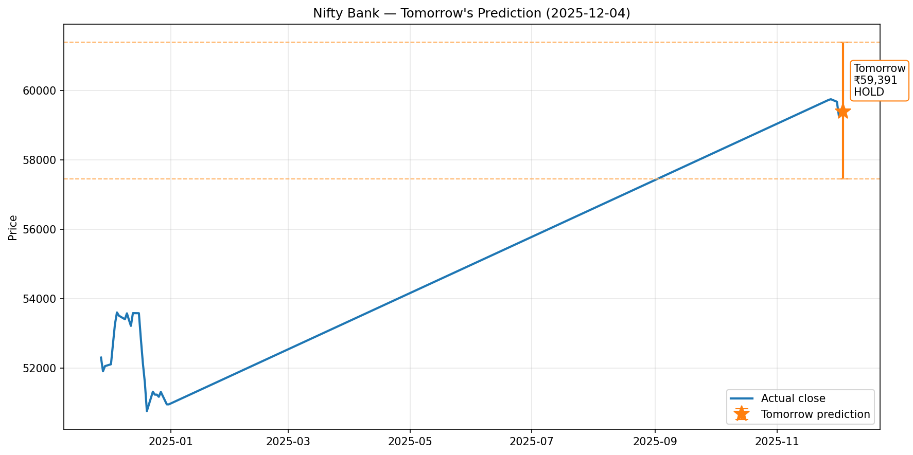
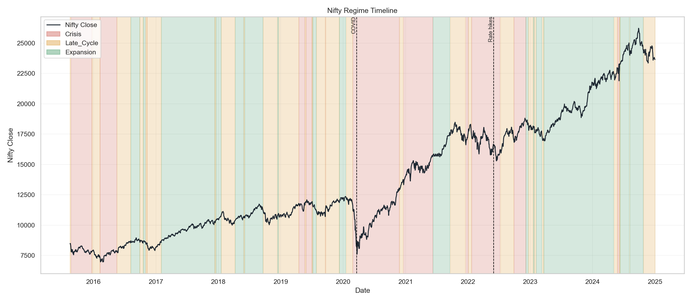
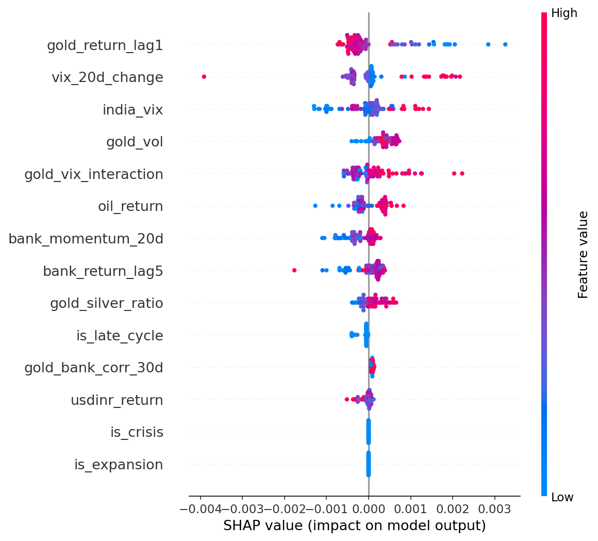
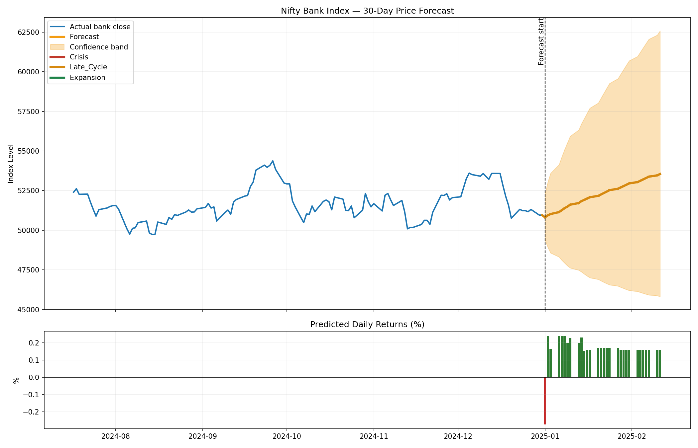
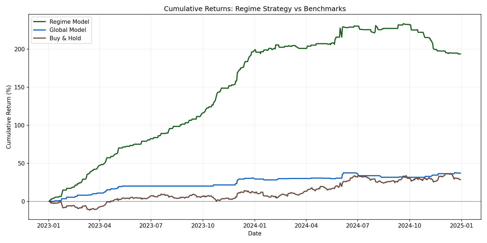

# Gold-Equity Regime Switching ML


Regime-aware machine learning for studying how **gold transmits information into Indian equity sectors** across stress, transition, and expansion periods.

This repository combines:

- `Gaussian HMM` regime detection
- `XGBoost` regime-specific prediction
- `SHAP` explainability
- forward forecasting and next-day prediction
- a `Streamlit` dashboard for live monitoring

---

## Why This Project Matters

Most financial models assume the same relationships hold in all market conditions.
This project tests the opposite idea:

> **Gold may behave very differently depending on the market regime.**

Instead of fitting one global model across all periods, this system:

1. identifies hidden market regimes,
2. trains regime-specific predictive models,
3. measures how gold's importance changes across those regimes.

The result is a more realistic, interpretable framework for **non-linear cross-asset transmission** in Indian markets.

---

## Project Highlights

| Area | Summary |
|---|---|
| Market | India |
| Frequency | Daily |
| Period | 2014-01-01 to 2024-12-31 |
| Final labeled dataset | 2,830 rows |
| Hidden regimes | Crisis, Late_Cycle, Expansion |
| Engineered features | 44 |
| Final compact prediction features | 11 |
| Main target | Next-day Bank Nifty return |
| Explainability | SHAP by regime |
| Deployment layer | Streamlit dashboard + tomorrow predictor |

---

## Core Finding

The strongest result in this project is not raw forecasting accuracy.
It is the **regime-dependent importance of gold**.

### Gold SHAP Importance by Regime

| Regime | Mean abs SHAP | Gold Feature Rank |
|---|---:|---:|
| Crisis | 0.000085 | #11 |
| Late_Cycle | 0.000562 | #1 |
| Expansion | 0.000249 | #4 |

### Interpretation

- In **Late_Cycle**, gold acts like a **leading fear / risk signal**
- In **Expansion**, gold still has **structural predictive value**
- In **Crisis**, liquidity and stress variables dominate, so gold becomes less central

### Statistical Result

- Crisis vs Expansion gold SHAP `t-stat = -9.185568`
- `p-value = 0.000007`
- Late_Cycle vs Expansion gold SHAP ratio = `2.25x`

This is the main research contribution of the project.

---

## Visual Snapshot

### Dashboard / Live Prediction Style Output


### Regime Timeline


### SHAP - Late Cycle


### Forecast View


### Backtest Curve


---

## Pipeline Architecture

### Layer 1 - Data Pipeline
**File:** `layer1_data_pipeline.py`

- Fetches market data using `yfinance`
- Builds return, volatility, momentum, lag, microstructure, correlation, and interaction features
- Produces the master dataset used downstream

### Layer 2 - Regime Detection
**File:** `layer2_regime_detection.py`

- Fits `GaussianHMM` models
- Detects hidden market states
- Assigns:
  - `Crisis`
  - `Late_Cycle`
  - `Expansion`

### Layer 3 - Regime-Specific Models + SHAP
**File:** `layer3_models_shap.py`

- Trains regime-aware `XGBoost` models
- Uses compact feature selection for stability
- Evaluates with walk-forward validation
- Computes regime-specific SHAP contributions

### Layer 4 - Backtest Report
**File:** `layer4_backtest_report.py`

- Backtests regime-aware trading logic
- Compares against:
  - global model
  - buy-and-hold
- Generates summary report and visual outputs

### Layer 5 - Forecasting
**File:** `layer5_forecast.py`

- Produces 5-day and 30-day forecasts
- Builds confidence bands
- Runs rolling forecast validation

### Live Prediction
**File:** `predict_tomorrow.py`

- Fetches current market data
- Detects the current regime
- Predicts the next-day Bank Nifty move
- Saves text and JSON outputs

### Dashboard
**File:** `dashboard.py`

- Streamlit dashboard
- Regime monitoring
- live prediction cards
- price and forecast visualization
- explainability panels

---

## Dataset Scope

### Main Inputs

- Gold
- Nifty 50
- Bank Nifty
- Nifty IT
- India VIX
- USD/INR
- Oil
- Silver

### Feature Families

- log returns
- rolling volatility
- momentum
- lagged returns
- Corwin-Schultz spread proxy
- Amihud illiquidity
- rolling correlations
- interaction features
- cross-asset ratios
- volatility regime indicators
- regime context features

---

## Final Honest Model Results

The final version of the model is **more convincing as a regime-aware research and explainability framework than as a production alpha engine**.

### Test Window

`2023-01-01` to `2024-12-31`

### Final Out-of-Sample Performance

| Model | R2 | RMSE | MAE | Direction% |
|---|---:|---:|---:|---:|
| Crisis_bank | -0.027 | 2.33% | 1.68% | 62.5% |
| Late_Cycle_bank | -0.041 | 0.95% | 0.73% | 48.4% |
| Expansion_bank | 0.000 | 0.79% | 0.58% | 52.2% |
| Ensemble | -0.004 | 0.86% | 0.62% | 52.2% |
| Global_bank | -0.072 | 0.89% | 0.63% | 52.2% |

### Walk-Forward Validation Mean R2

| Regime | Mean R2 | Std |
|---|---:|---:|
| Crisis | -0.051 | 0.096 |
| Late_Cycle | -0.054 | 0.046 |
| Expansion | -0.044 | 0.058 |

### Directional Threshold Result

- Best signal threshold: `+/- 0.30%`
- Direction accuracy at threshold: `68.18%`

### Honest Conclusion

The final predictive R2 is weak.
That means this project should be presented primarily as:

- a **regime-switching market intelligence framework**
- an **explainability study of gold's changing role**
- a **financial ML systems project**

and not as a finished live-trading model.

---

## Backtest Snapshot

The repository also contains a stronger historical backtest artifact from an earlier strategy stage:

| Strategy | Total Return | Ann. Return | Sharpe | Max DD | Win Rate |
|---|---:|---:|---:|---:|---:|
| Regime Model | 193.59% | 68.36% | 6.3318 | -11.94% | 52.32% |
| Global Model | 37.12% | 16.50% | 1.9104 | -4.26% | 40.45% |
| Buy & Hold | 28.50% | 12.89% | 0.5777 | -11.89% | 53.93% |

**Important note:** this backtest report should be interpreted carefully alongside the final Layer 3 results, because the final honest forecasting performance is weaker than the earlier strategy artifact suggests.

---

## Repository Structure

```text
.
├── data/
│   ├── gold_equity_master_data.csv
│   └── regime_labeled_data.csv
├── models/
│   ├── hmm_model.pkl
│   ├── hmm_scaler.pkl
│   ├── Crisis_bank.pkl
│   ├── Late_Cycle_bank.pkl
│   ├── Expansion_bank.pkl
│   ├── Global_bank.pkl
│   └── ensemble_model.pkl
├── outputs/
│   ├── layer3_improved_results.txt
│   ├── layer4_results.txt
│   ├── layer5_forecast.txt
│   ├── prediction_latest.json
│   └── final_report.html
├── visualizations/
│   ├── regime_timeline.png
│   ├── regime_boxplot.png
│   ├── transition_heatmap.png
│   ├── shap_summary_Crisis.png
│   ├── shap_summary_Late_Cycle.png
│   ├── shap_summary_Expansion.png
│   ├── price_forecast.png
│   ├── tomorrow_prediction.png
│   └── cumulative_returns.png
├── layer1_data_pipeline.py
├── layer2_regime_detection.py
├── layer3_models_shap.py
├── layer4_backtest_report.py
├── layer5_forecast.py
├── predict_tomorrow.py
└── dashboard.py
```

---

## How to Run

### Install Dependencies

```bash
pip install -r requirements.txt
```

### 1. Tomorrow Prediction

```bash
python predict_tomorrow.py
```

### 2. Streamlit Dashboard

```bash
streamlit run dashboard.py
```

### 3. Full Pipeline Scripts

```bash
python layer1_data_pipeline.py
python layer2_regime_detection.py
python layer3_models_shap.py
python layer4_backtest_report.py
python layer5_forecast.py
```

---

## Tech Stack

- Python
- pandas
- numpy
- yfinance
- hmmlearn
- xgboost
- shap
- scikit-learn
- matplotlib
- plotly
- streamlit

---

## Best Use Cases

This project is especially useful as:

- a portfolio project for **quant finance / ML roles**
- a research prototype for **regime-aware market modeling**
- a demonstration of **time-series validation discipline**
- an interpretable **cross-asset transmission study**

---

## Disclaimer

This is an academic machine learning project.
It is **not financial advice**, and the final model should not be treated as a production trading system without further validation, robustness checks, and deployment controls.
